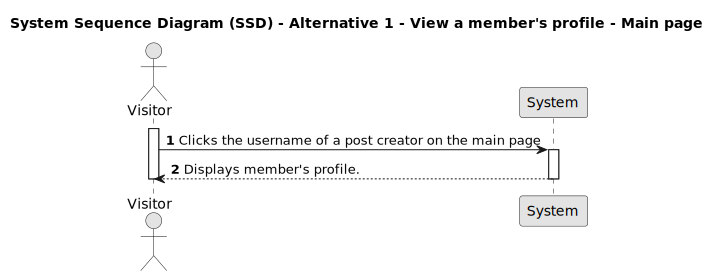
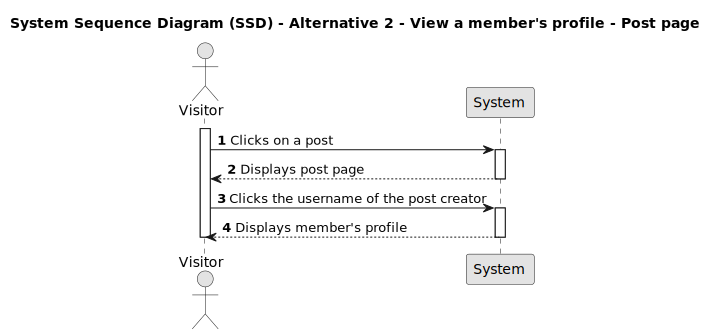

# US 010 - View member's profiles

## 1. Requirements Engineering

### 1.1. User Story Description

**As a Member**,

**I want to** view users information, including: username, email, number of posts made, number of comments written, and the user with the greatest number of comments along their number of comments,

**so that** I can keep track of my activity on the platform and see who the most active user is.

### 1.2. Customer Specifications and Clarifications

- The member's name and email should be displayed prominently.
- The number of posts and comments by the current member should be visible.
- The member with the greatest number of comments and their count should be displayed for reference.
- The member information should be displayed in a user-friendly format.

### 1.3. Acceptance Criteria

**AC1:** Registered User must be logged in to access their and others member-related information.

**AC2:** The members information, including user name, email, number of posts, number of comments, user with the most comments, and their count, must be displayed.

**AC3:** The member name with the greatest number of comments should be determined correctly.

**AC4:** The number of the comments by the member with the greatest number of comments should be displayed correctly.

**AC5:** Main member Information and top-commenter should be displayed in different tables.

### 1.4. Found out Dependencies

_There is a dependency to "US013 - Register an account*._

_There is a dependency on the availability of user posts and comments data._

### 1.5 Input and Output Data

**Input Data:**

- Selected data:
  - "by _member name_" option on main page;
  - "by _member name_" option on a post page;

**Output Data:**

- Member's profile page along member-related information is displayed.

### 1.6. System Sequence Diagram (SSD)

#### Alternative One

#### Alternative Two

### 1.7 Other Relevant Remarks

n/a
