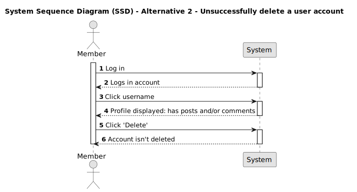

# US 013 - Delete user

## 1. Requirements Engineering

### 1.1. User Story Description

- As a member, I want to be able to delete my account.

### 1.2. Customer Specifications and Clarifications

- Can I delete my account if I haven't made any posts or comments?

### 1.3. Acceptance Criteria

- **AC1:** The member must be logged in.
- **AC2:** The member must be able to navigate to their profile page when clicking on their name.
- **AC3:** The delete button must be accessible through the member's profile.
- **AC4:** If there are no posts or comments made by the user he may delete his account.
- **AC5:** If the user deletion is successful the user must be logged out.

### 1.4. Found Dependencies

- There is a dependency on "US010 - View member's profiles".
- There is a dependency on "US011 - Login".
- There is a dependency on "US012 - Logout".

### 1.5. Input and Output Data

**Input Data:**

N/A

**Output Data:**

N/A

### 1.6. System Sequence Diagram (SSD)

#### Alternative One

#### Alternative Two

### 1.7. Other Relevant Remarks

N/A

### 1.8. Bugs

The member page is not functional yet.
 