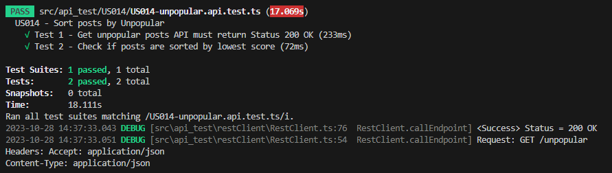

## 1. Sort posts by Unpopular

### 1.1 Description

This section aims to create a new functionality that displays posts by ascending order based on the number of votes.

### 2. Documentation

[Requirements-Engeneering](../../sprintA/sprintA/us014/01.requirements-engeneering/readme.md)

[Tests](../../sprintA/sprintA/us014/02.tests/readme.md)

### 2.1 Acceptance Criteria

**AC1:** Visitor must be able to access to the DDD Forum.

**AC2:** The maximum number of posts visible to the Visitor must be 15.

**AC3:** Visitor can sort posts by unpopular.

**AC4:** Unpopular posts must be ordered by lowest to highest score.

### 2.2 New term "Unpopular" added to glossary

### 2.3. System Sequence Diagram (SSD)

### 2.4 Sequence Diagram (SD)

We created a comprehensive sequence diagram that demonstrates how the sort by unpopular works within our API. This diagram provides a clear and organized visual representation, demonstrating the precise interactions between objects, classes, and methods. It serves as a valuable tool for understanding the flow of data and actions that occur when posts are sorted, allowing for a deeper comprehension of the API workings.

### 3. Back-End

### 3.1 Route

We have created a new route for this functionality.

### 3.2 Use Case

A new folder with a new use case, along with its controllers and DTOs, was also created

### 3.3 PostRepo

We added the getUnpopularPosts method to the IPostRepo interface.

### 3.4 SequelizePostRepo

We added the getUnpopularPosts method to the sequelizePostRepo file. This method is responsible for querying the database and returns the posts ordered by 'points' and in ascending order 'ASC'."

### 4. Back-End API Tests

### 4.1 Endpoint

To perform API tests, we created a specific endpoint for this user story.

### 4.2 Tests

The Sort Posts by Unpopular functionality was successfully tested

### 5. Front-End

### 5.1 New Unpopular Section

On the front end, we added a new section/tab on the main page of the app called 'Unpopular.

### 5.1.1 PostFilter.tsx

To do this, we added a new filter into the PostFilter.tsx file

### 5.2 Redux Operators

We added a new file to the 'redux -> operators' folder called 'getUnpopularposts.tsx' with the 'getUnpopularposts' function.

### 5.2.1 Redux Operators Index

We added the 'getUnpopularPosts' method to the 'operators/index.tsx' file.

### 5.2.1 Redux Operators Actions

We added the new methods, getUnpopularPosts, getUnpopularPostsSuccess, and getUnpopularPostsFailure, to the actionCreators.tsx file.

We defined also the actions in the actions.tsx file

We added the previously defined actions to the reducers.tsx file.

We added the respective states to the states.tsx file.

### 5.3 Unpopular Posts Appearance

Finally, we inserted data with both positive and negative votes, and the Unpopular functionality is working as expected, sorting the posts in ascending order, with the least voted posts first.

